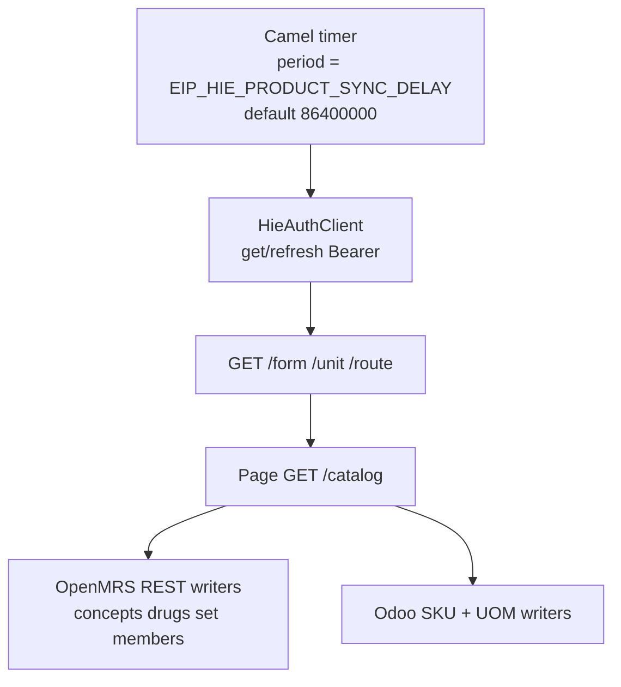
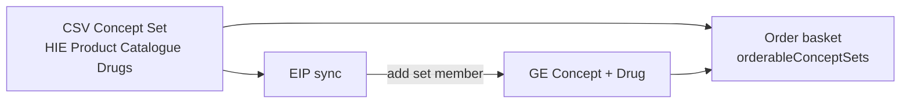
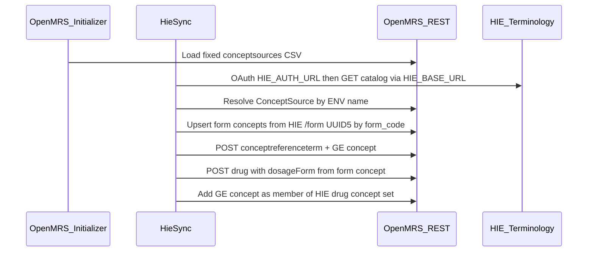
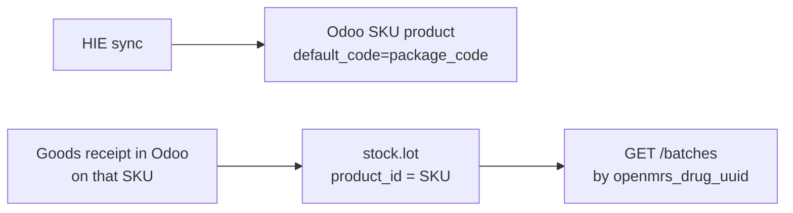
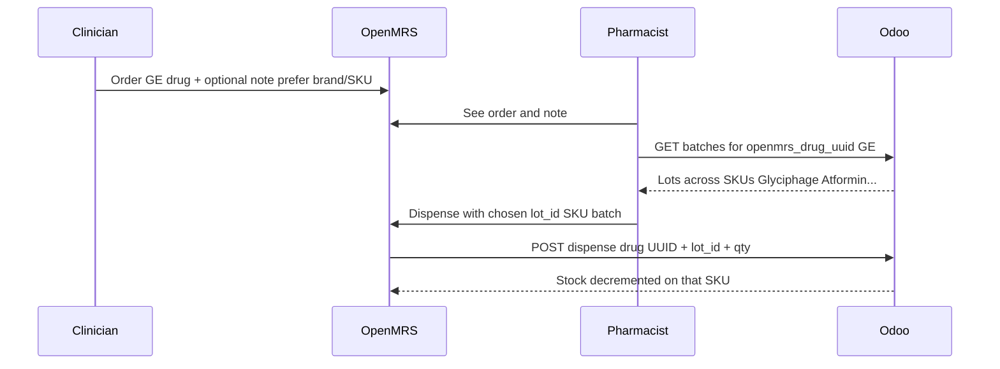
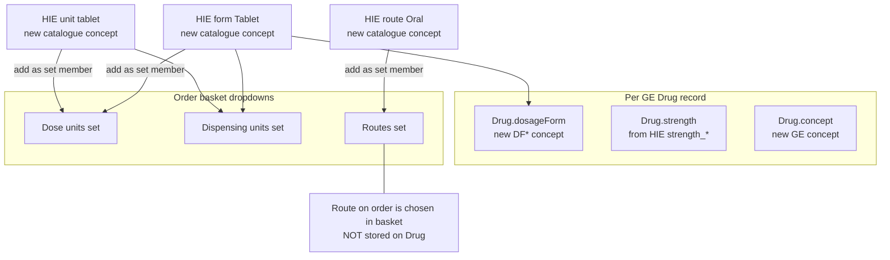

# HIE Product Catalogue Sync

> Exported from Cursor plan `hie_product_catalogue_sync_a34a1243`.

**Overview:** Drugs-only HIE sync via EIP Camel scheduled routes (default daily, ENV-configurable); shared UUID5 units; catalogue-only dispensing set; NEW Concept+Drug per GE.

## Tasks

- [x] **phase0-api-contract** — Capture HIE catalog/product JSON samples and field-mapping
- [x] **disable-odoo-openmrs-sync** — Disable ProductSynchronizer via feature flag; update compose/properties defaults
- [x] **drop-csv-drugs** — Stop seeding Odoo drug/pharma product CSVs only; keep other products and services
- [x] **hie-client-sync** — EIP Camel routes for HIE catalogue sync; scheduled by default once/day via ENV
- [x] **hie-auth-client** — HieAuthClient: client-credentials; cache/refresh; Bearer on all HIE calls
- [x] **hie-scheduled-route** — Camel timer route; default 1 day; ENV enable + delay
- [x] **concept-source-csv** — Seed ConceptSource + drug/dispensing-units sets; GP override
- [x] **openmrs-refdata / drug writers** — Forms/units/GE Concept+Drug + set membership
- [x] **odoo-sku-writers** — UOM UUID5 + multi-SKU product upsert
- [x] **inventory-multi-sku** — Batches across SKUs; dispense by lot_id; unit uuid check
- [ ] **pharmacy-dispense-ux** — Pharmacist batch picker UI (SPA) shows SKU name — API ready; UI may live outside this repo
- [x] **tests** — HieUuid UUID5 + MedicationDispenseProcessor payload tests

---

# HIE Product Catalogue Sync (drugs only)

## Decisions (confirmed)

- **HIE is master**; parallel **HIE→OpenMRS** and **HIE→Odoo**.
- **Orchestration = EIP Camel routes** in [`eip-odoo-openmrs-ampath`](eip-odoo-openmrs-ampath/) — scheduled sync (not ad-hoc scripts, not Spring `@Scheduled` like the old `ProductSynchronizer`). Auth, terminology pulls, OpenMRS writers, and Odoo SKU writers all run on that schedule.
- **Schedule default = once per day**; period (and enable) controlled by ENV (see below).
- **Disable** Odoo→OpenMRS [`ProductSynchronizer`](eip-odoo-openmrs-ampath/src/main/java/com/ozonehis/eip/odoo/openmrs/ProductSynchronizer.java).
- **No CSV drug catalogue** — stop seeding Odoo **drug/pharma** product CSVs (HIE owns those). **Keep** Initializer seeding for other products and services (lab tests, procedures, consultations, equipment, non-pharma stock, etc.).
- **Sync drugs only** — no medical-supply / MEDICAL SUPPLIES SET work in this plan.
- **OpenMRS orderable unit = Generic Concept (GE)** — one Concept + one Drug per `GE*`.
- **Always create new OpenMRS Concepts + Drugs** for catalogue items — **never** reuse or name-match existing CIEL/AMPATH/local drugs or ingredient concepts.
- **Catalogue concepts must be identifiable** via a ConceptSource seeded from a **fixed Initializer CSV**, and the EIP client is told which source to use via ENV (see below).
- **Orderable catalogue drugs** live in a **new concept set** seeded from a fixed Initializer CSV; EIP adds each GE concept as a member; order basket SPA config points `orderableConceptSets` at that set uuid.
- **HIE units** use one **UUID5(`hie:unit:{unit_code}`)** everywhere: OpenMRS unit concept, Odoo `uom.uom` identity, and `medication_dispense` quantity-unit uuid — so dispense qty units always match product stock UOM.
- **Dispensing-instruction concept set is catalogue-only** (CSV-seeded empty set; GP points at it; members = HIE `/unit` concepts only — no CIEL/legacy units in that set).
- **Odoo stock unit = package SKU** — one `product.product` per `package_code` (e.g. `PH12866-2`), many SKUs per GE.
- **HIE HTTP config matches [hie-saf](/Users/emmanuel/Code/AMPATH/amrs-integrations/packages/hie-saf)** env var names/URLs (auth + `HIE_BASE_URL` facade).

## HIE env vars (from hie-saf)

Reuse the same OAuth + facade keys as [`packages/hie-saf/.env.example`](/Users/emmanuel/Code/AMPATH/amrs-integrations/packages/hie-saf/.env.example) / README. Document them in [`.env.odoo.example`](.env.odoo.example) and wire into EIP/`application.properties` + compose.

| Env var | Role | Example shape (UAT) |
|---|---|---|
| `HIE_AUTH_URL` | OAuth token endpoint | `https://accounts-uat.dha.go.ke/realms/hie/protocol/openid-connect/token` |
| `HIE_CLIENT_ID` | OAuth client id | (secret per env) |
| `HIE_CLIENT_SECRET` | OAuth client secret | (secret per env) |
| `HIE_GRANT_TYPE` | OAuth grant | `client_credentials` |
| `HIE_BASE_URL` | HIE facade base (registries, terminology under this) | `https://ilm-dev.dha.go.ke/adapter/facade` |
| `HIE_TEST_BEARER_TOKEN` | Optional local/test override (skip token fetch), same as hie-saf | unset in prod |
| `EIP_HIE_PRODUCT_SYNC_ENABLED` | When `true`, Camel schedule route auto-starts | `true` (or `false` until ready) |
| `EIP_HIE_PRODUCT_SYNC_DELAY` | Milliseconds between catalogue sync runs (Camel timer period) | `86400000` (24h) |
| `EIP_HIE_PRODUCT_SYNC_INITIAL_DELAY` | Milliseconds before first run after EIP start | e.g. `60000` |

Wire these into EIP `application.properties` + compose / [`.env.odoo.example`](.env.odoo.example).

**Auth client — token for all subsequent HIE requests**

EIP implements a **HieAuthClient** (same pattern as hie-saf `HieAuthService`), invoked by the scheduled Camel sync route(s):

1. Client-credentials POST to `HIE_AUTH_URL` with `HIE_CLIENT_ID`, `HIE_CLIENT_SECRET`, `HIE_GRANT_TYPE`.
2. Cache `access_token` (and `expires_in`); refresh/re-fetch before expiry (or on 401).
3. Attach `Authorization: Bearer <token>` on **every** terminology/catalog HTTP call under `${HIE_BASE_URL}/hie/api/v1/terminology-service/...`.
4. Fail fast if token fetch fails; do not proceed to product upsert. Never log secrets or full tokens.

Local/dev supplies the same `HIE_AUTH_*` envs. Optional: `HIE_TEST_BEARER_TOKEN` skips the token fetch for offline/manual testing (same as hie-saf); leave unset when using real OAuth.

## EIP Camel scheduled sync

All catalogue work runs inside **EIP Camel routes** (same module as [`MedicationDispenseRouting`](eip-odoo-openmrs-ampath/src/main/java/com/ozonehis/eip/odoo/openmrs/routes/MedicationDispenseRouting.java)):



| Concern | Behavior |
|---|---|
| Trigger | Camel `timer` (or equivalent) route — **not** Spring `@Scheduled` |
| Default period | Once per day (`86400000` ms) |
| Configurable | `EIP_HIE_PRODUCT_SYNC_DELAY` (+ optional `EIP_HIE_PRODUCT_SYNC_INITIAL_DELAY`) |
| Enable/disable | `EIP_HIE_PRODUCT_SYNC_ENABLED` gates `autoStartup` / route start |
| Pipeline | Auth → refdata (form/unit/route) → page catalog → upsert OpenMRS GE drugs + Odoo SKUs in one run |

Do **not** rely on a separate one-shot smoke job for auth; the scheduled route uses HieAuthClient on every run.

**Terminology API base (derived, not a separate hie-saf key):**

`${HIE_BASE_URL}/hie/api/v1/terminology-service`

Endpoints used by sync (relative to that base): `/catalog`, `/product`, `/generic-concept`, `/form`, `/route`, `/unit`, `/package`, `/active-component` as needed.

Auth: **HieAuthClient** obtains/caches Bearer via client-credentials POST to `HIE_AUTH_URL` and attaches it on every terminology GET (same pattern as hie-saf `HieAuthService`). Catalogue sync does **not** require `HIE_CLIAMS_BASE_URL` / `HIE_SHR_BASE_URL` (claims/SHR only).

**ConceptSource for EIP (lookup only — not used to rewrite CSV):**

| Env var | Role | Default / example |
|---|---|---|
| `HIE_PRODUCT_CATALOGUE_CONCEPT_SOURCE_NAME` | Name of the CSV-seeded ConceptSource; EIP resolves it and uses it when creating reference terms / concept mappings | `HIE Product Catalogue` |
| `HIE_PRODUCT_CATALOGUE_DRUG_CONCEPT_SET_UUID` | UUID of the CSV-seeded concept set that holds orderable GE drug concepts; EIP adds each new GE concept as a set member | same uuid as in the concept-set CSV |
| `HIE_PRODUCT_CATALOGUE_DISPENSING_UNITS_CONCEPT_SET_UUID` | UUID of the CSV-seeded **catalogue-only** dispensing-units set; EIP adds each HIE `/unit` concept as a member; GP `order.drugDispensingUnitsConceptUuid` points here | same uuid as in the dispensing-units concept-set CSV |

Prefer ConceptSource **name** and concept-set **uuids** in ENV. EIP caches resolved ConceptSource uuid after first lookup. If source or set is missing → fail loudly; do **not** create them from EIP.

## ConceptSource via Initializer CSV (fixed values)

Seed the ConceptSource once with OpenMRS Initializer. **No env-substitution** on this CSV — values are fixed in the file.

1. Add Initializer CSV under OpenMRS distro config, e.g. `distro/config/openmrs/initializer_config/conceptsources/hie_product_catalogue.csv`:

```csv
Uuid,Void/Retire,Name,Description,Hl7 Code
<a-fixed-uuid>,,HIE Product Catalogue,Kenya HIE product catalogue terminology,HIEPC
```

2. EIP is configured with `HIE_PRODUCT_CATALOGUE_CONCEPT_SOURCE_NAME=HIE Product Catalogue` (must match the CSV `Name`).
3. When creating concepts, EIP: resolve ConceptSource by that ENV name → create `conceptreferenceterm` under it → create concept with SAME-AS mapping → create drug → add GE concept to the drug concept set (below).

## Orderable drug concept set via Initializer CSV

Create a **new empty concept set** that the medications order basket will use. Sync does not create the set; it only **adds members**.

1. Seed via Initializer concepts CSV (fixed uuid/name — no env-substitution), e.g. `distro/config/openmrs/initializer_config/concepts/hie_product_catalogue_drugs_set.csv`:

```csv
Uuid,Void/Retire,Fully specified name:en,Short name:en,Description:en,Data class,Data type,_version:1,_order:1
<hie-drug-set-uuid>,,HIE Product Catalogue Drugs,HIE Drugs,Orderable drugs from Kenya HIE product catalogue,ConvSet,N/A,,
```

(Exact Initializer column headers follow this distro’s existing concepts CSV convention; set class = Concept Set / ConvSet as used locally. Start with **no members** — members are added by EIP.)

2. EIP env: `HIE_PRODUCT_CATALOGUE_DRUG_CONCEPT_SET_UUID=<hie-drug-set-uuid>` (must match CSV Uuid).
3. On each successful GE Concept+Drug upsert: ensure that concept uuid is a **set member** of this concept set (`POST` set membership / update set members). Retire/remove membership when the GE is retired and has no active packages.
4. **Order basket config** — point SPA at this set so clinicians only (or also) order from catalogue drugs. Update [`frontend/configuration/config.json`](frontend/configuration/config.json):
   - Prefer configuring drug orders via `orderableConceptSets: ["<hie-drug-set-uuid>"]` on the Drug order type (same pattern as medical supplies / radiology in that file).
   - Wire into `@openmrs/esm-patient-medications-app` and/or `@openmrs/esm-patient-orders-app` as required by the local medications workspace (medications app today mainly uses drug search; if basket filtering needs the set, add the set uuid where orderable drugs are constrained).
5. Legacy AMPATH drugs remain outside this set unless explicitly migrated later (out of scope).



## Identifying Product Catalogue concepts

Every OpenMRS concept (and drug) created from the HIE catalogue is tagged so it can be queried/filtered separately from pre-existing dictionary content.

| Mechanism | Value | Purpose |
|---|---|---|
| **ConceptSource** | Fixed CSV name `HIE Product Catalogue`; EIP finds it via `HIE_PRODUCT_CATALOGUE_CONCEPT_SOURCE_NAME` | Primary filter: “show me catalogue concepts” |
| **Concept reference term** | `POST /conceptreferenceterm` with that `conceptSource` + `code` = HIE code (`GE10002`, `DF10501`, …) | Stable code under that source |
| **Concept mapping** | on `POST /concept` (or mapping subresource): map type SAME-AS → that reference term | Links the concept to the catalogue code |
| **Deterministic UUID** | UUID5 for type+code: `hie:ge:{GE}`, `hie:form:{form_code}`, `hie:route:{route_code}`, `hie:unit:{unit_code}` | Same uuid across reinstalls; create only when missing |
| **Drug** | `POST /drug` with `concept` = catalogue GE concept; drug uuid = UUID5(`hie:ge:{GE}`) so Odoo `x_openmrs_drug_uuid` is stable | Orderable catalogue drug |

**Lookup (identify catalogue concepts):**

- `GET /ws/rest/v1/concept?source=HIE+Product+Catalogue&code=GE10002`
- Or `GET /ws/rest/v1/drug/{uuid5}` after first create
- Do **not** use `GET /drug?q=name` to decide upsert identity

**Rules:**

1. **Never** search OpenMRS drugs/concepts by display name to attach an HIE row to an existing drug.
2. Upsert key is only: ConceptSource name (from ENV / CSV) + HIE code (or the UUID5 derived from that code).
3. Forms, routes, and units from HIE are also **new** concepts under the same ConceptSource (not mapped onto CIEL “Tablet” / “Oral”). Units go **only** into the catalogue-only dispensing-units set (§2b). Forms/routes are added to their respective order-entry sets as planned.
4. Concept class for GE drugs: **Drug** (or Misc if required by local dictionary policy); datatype **N/A**. Form/route/unit: appropriate class (e.g. Misc / Units of Measure) with datatype N/A.

```text
HIE Product Catalogue (ConceptSource, fixed CSV)
├── GE10002  → Concept + Drug "Metformin 500 mg Oral Tablet"  (new)
├── DF10501  → Concept "Tablet" (catalogue form; member of dosing/dispensing sets)
├── RT10025  → Concept "Oral"   (catalogue route; member of routes set)
└── UM…      → Concept "tablet" / "mg" (catalogue units; members of unit sets)
```

## OpenMRS REST write path ([Drugs API](https://rest.openmrs.org/#drugs))

Catalogue drugs are written with the standard REST resources — **concept first, then drug**. The Drugs resource does **not** create the concept; `concept` is a required UUID of an existing concept.



### 1. ConceptSource + drug concept set (CSV seed + ENV for EIP)

- CSV seeds ConceptSource and empty **HIE Product Catalogue Drugs** concept set with fixed Name/Uuid.
- EIP ENV `HIE_PRODUCT_CATALOGUE_CONCEPT_SOURCE_NAME` → which source to use for mappings.
- EIP ENV `HIE_PRODUCT_CATALOGUE_DRUG_CONCEPT_SET_UUID` → which set receives GE concepts as members.
- SPA `config.json` `orderableConceptSets` includes that same set uuid for the drug order basket.

### 2. Dosage form concepts from HIE `/form` (required for correct `Drug.dosageForm`)

Before creating/updating drugs, ensure dosage-form concepts exist from the HIE forms terminology API:

`GET ${HIE_BASE_URL}/hie/api/v1/terminology-service/form`

(Auth: Bearer from `HIE_AUTH_*` as above.)

| HIE field | OpenMRS use |
|---|---|
| `form_code` (e.g. `DF10501`) | Upsert key + ConceptSource reference term code |
| `form_description` (e.g. `Tablet`) | Concept fully specified name |
| — | Concept uuid = **UUID5(`hie:form:{form_code}`)** (deterministic) |

**Create only when needed:**

1. Compute `uuid = UUID5(namespace, "hie:form:" + form_code)`.
2. `GET /ws/rest/v1/concept/{uuid}` (or lookup by ConceptSource + `form_code`).
3. If found → reuse (update name/mapping if drifted).
4. If missing → `POST /concept` with that `uuid`, datatype N/A, appropriate class (e.g. Misc / Dosage Form), SAME-AS map to ConceptSource + `form_code`.
5. Ensure the form concept is a member of dosing/dispensing order-entry sets when needed for basket defaults.
6. When creating the Drug: set `dosageForm` to this form concept uuid (from the GE/catalog row’s `form_code`).

Do **not** create a new form concept per drug or per package — one OpenMRS concept per distinct `form_code`. Do **not** map onto CIEL Tablet/etc.

Prefetch/cache all `/form` rows (or upsert on first use of each `form_code` during catalog sync).

### 2b. Unit concepts from HIE `/unit` (shared UUID5 + catalogue-only dispense set)

HIE units must be selectable as the **quantity / dispensing unit** on the drug order form, stored on **MedicationDispense** as that unit’s concept uuid, and be the **Odoo product UOM** — all three share the **same UUID5**.

`GET ${HIE_BASE_URL}/hie/api/v1/terminology-service/unit`

**Shared identity (idempotent, consistent across systems):**

```text
unit_uuid = UUID5(namespace, "hie:unit:" + unit_code)
```

| System | Where `unit_uuid` lives |
|---|---|
| OpenMRS | `concept.uuid` for the unit concept |
| OpenMRS order | Drug order / MedicationDispense **quantityUnits** (or equivalent) concept uuid |
| Odoo | `uom.uom` via `ir.model.data` name = `unit_uuid` (module `init`); `product.product.uom_id` / `uom_po_id` → that UOM |

So: `medication_dispense.quantityUnits.uuid` **==** OpenMRS unit concept uuid **==** Odoo product UOM external id. No name-only matching for identity.

| HIE field | OpenMRS | Odoo |
|---|---|---|
| unit code | Concept uuid = `unit_uuid`; reference term under ConceptSource | Upsert `uom.uom` keyed by `unit_uuid` |
| unit description | Concept name | `uom.uom.name` |

**Catalogue-only dispensing-units concept set (CSV):**

1. Seed empty set via Initializer CSV, e.g. `HIE Product Catalogue Dispensing Units` with fixed uuid (no env-substitution) — parallel to the drugs concept set.
2. Set global property **`order.drugDispensingUnitsConceptUuid`** to **that set only**.
3. EIP adds **only** HIE `/unit` concepts as members. Do **not** append catalogue units into an existing AMPATH/CIEL dispensing set, and do **not** leave legacy units in the set used by the order form.
4. Result: dispensing-instruction dropdown on the order form lists **catalogue units only**.

**Create only when needed:**

1. Compute `unit_uuid`; GET OpenMRS concept by uuid — create if missing (SAME-AS map to ConceptSource + unit code).
2. Add concept as member of the **catalogue-only** dispensing-units set.
3. Upsert Odoo `uom.uom` with the **same** `unit_uuid` as external id; set SKU `uom_id` / `uom_po_id` to that UOM.
4. Dispense path: MedicationDispense quantity unit uuid must equal product’s UOM external id; Odoo `POST /dispense` qty is in that UOM (1:1 — no conversion). Reject or alert if dispense unit uuid ≠ product UOM uuid.

```mermaid
flowchart LR
  hieUnit["HIE /unit\nunit_code"]
  uuid5["UUID5 hie:unit:code"]
  omrsConcept["OpenMRS concept.uuid"]
  mdQty["medication_dispense\nquantityUnits.uuid"]
  dispSet["Catalogue-only set\norder.drugDispensingUnitsConceptUuid"]
  basket["Order form\ndispensing instruction"]
  odooUom["Odoo uom.uom\nir.model.data = same uuid"]
  product["product.uom_id"]
  stock["Inventory dispense"]
  hieUnit --> uuid5
  uuid5 --> omrsConcept
  uuid5 --> odooUom
  omrsConcept --> dispSet
  dispSet --> basket
  basket --> mdQty
  mdQty -->|"same uuid"| odooUom
  odooUom --> product
  product --> stock
```



Do **not** use a generic Odoo “Units” UOM, do **not** match UOMs by display name alone for identity, and do **not** mix legacy concepts into the dispensing-instruction set.

### 3. Ensure reference term + concept (per GE / route)

`POST /ws/rest/v1/conceptreferenceterm` → `{ code, conceptSource, name }`  
`POST /ws/rest/v1/concept` → names, datatype N/A, conceptClass, `mappings: [{ conceptReferenceTerm, conceptMapType: SAME-AS }]`, optional `uuid`

GE concepts: UUID5(`hie:ge:{GE}`). Form concepts: §2. Unit concepts: §2b. Route: UUID5(`hie:route:{route_code}`) via `/route` as needed for the routes set.

### 4. Create / update Drug ([Create a drug](https://rest.openmrs.org/#create-a-drug))

`POST /ws/rest/v1/drug` (create) or `POST /ws/rest/v1/drug/:uuid` (update)

| Parameter | Type | Description |
| --- | --- | --- |
| concept | `Concept_UUID` | Concept describing this drug |
| combination | `Boolean` | Is this drug a combination |
| name | `String` | Name of a drug |
| minimumDailyDose | `Double` | Minimum drug daily dose |
| maximumDailyDose | `Double` | Maximum drug daily dose |
| dosageForm | `Concept_UUID` | Concept describing dosage form of this drug |

Documented create attributes map as:

| Field | HIE mapping |
|---|---|
| `concept` | UUID of **new** GE catalogue concept (required) |
| `name` | `generic_full_display_name` |
| `dosageForm` | UUID5 form concept for the row’s `form_code` (must already exist from `/form` sync) |
| `combination` | `true` if GE implies multi-ingredient; else `false` |
| `minimumDailyDose` / `maximumDailyDose` | omit unless HIE provides them |

Also set when supported by the running OpenMRS version (present on drug representations even if omitted from the create attribute table):

| Field | HIE mapping |
|---|---|
| `uuid` | UUID5(`hie:ge:{GE}`) on create so Odoo link is stable |
| `strength` | `strength_display_name` (e.g. `500 mg`) |

Retire path: `DELETE /ws/rest/v1/drug/:uuid` (soft retire) when no active packages remain for that GE.

### 5. Order-entry set membership

- **Dispensing units:** members of the **catalogue-only** set only (see §2b); GP `order.drugDispensingUnitsConceptUuid` → that set.
- **Routes / dosing / duration:** catalogue concepts as planned; dosing set may also include HIE units if dose unit = dispense unit, but the **dispensing-instruction** GP set stays catalogue-units-only.

## How multiple SKUs share one drug UUID

There is **one OpenMRS drug UUID per GE** (clinical/orderable identity). That same UUID is stored on **every** related Odoo SKU product as `x_openmrs_drug_uuid`. It is **not** the Odoo product’s unique external id.

| Field | OpenMRS Drug (GE) | Odoo SKU A | Odoo SKU B |
|---|---|---|---|
| Clinical id | uuid = UUID5(`hie:ge:GE10002`) | — | — |
| `x_openmrs_drug_uuid` | — | **same** UUID5(`hie:ge:GE10002`) | **same** UUID5(`hie:ge:GE10002`) |
| Unique SKU id | — | `default_code` = `PH12866-2`; `ir.model.data` name = package_code (or UUID5 of it) | `default_code` = `PH13828-1`; own `ir.model.data` |
| Display | Metformin 500 mg Oral Tablet | Glyciphage 500 mg Oral Tablet (10x10) | Atformin 500 mg Oral Tablet (…) |

```text
OpenMRS                          Odoo
────────                         ────
Drug GE10002                     product Glyciphage … (10x10)
  uuid: aaa-bbb-…                  default_code: PH12866-2
                                   x_openmrs_drug_uuid: aaa-bbb-…   ← shared
                                   ir.model.data: init.PH12866-2    ← unique

                                 product Atformin … (…)
                                   default_code: PH13828-1
                                   x_openmrs_drug_uuid: aaa-bbb-…   ← shared
                                   ir.model.data: init.PH13828-1    ← unique
```

**Lookup rules:**

- **Order / MedicationDispense** use the OpenMRS **drug uuid** only (GE).
- **List batches for pharmacist:** `product.product` where `x_openmrs_drug_uuid = {drug uuid}` → many SKUs; each lot carries that product’s `product_name` / `default_code`.
- **Dispense with `lot_id`:** use `lot.product_id` (the specific SKU); do **not** require `ir.model.data` name = drug uuid.
- **Do not** create `ir.model.data` named with the GE drug uuid on every SKU (that would collide). Shared link = **`x_openmrs_drug_uuid` field only**.

So “share a drug uuid” means: **many Odoo products point at one OpenMRS drug via a repeated custom field**, not one shared primary key / XML id.

### Ordering (OpenMRS)

Clinician orders the **GE drug** (e.g. Metformin 500 mg Oral Tablet). Brand/SKU is **not** a separate orderable drug.

If a brand/SKU preference is needed, the clinician puts it in the **order note / dosing instructions** (free text, e.g. “prefer Glyciphage” or “PH12866”). That note is advisory only — it does not change the MedicationRequest drug UUID.

### Stocking (Odoo)

Each catalog package becomes its own stockable product:

- `name` ← `brand_full_display_name` + `package_name` (e.g. `Glyciphage 500 mg Oral Tablet (10x10)`)
- `default_code` ← `package_code`
- `categ_id` ← Drugs
- `x_openmrs_drug_uuid` ← shared GE drug UUID
- `x_concept_code` ← `GE10002`
- UOM ← `uom.uom` with external id = UUID5(`hie:unit:{unit_code}`) (same as OpenMRS unit concept / MedicationDispense quantityUnits)
- Inventory quantities and dispense qty are in this UOM; validate dispense unit uuid matches product UOM uuid

### Lot / batch creation and showing the correct SKU

**Lots are not created by HIE sync.** HIE sync only upserts **SKU products** (`package_code`). Lots (`stock.lot`) are created in Odoo when stock is received against a **specific SKU product** (purchase receipt, internal transfer, or inventory adjustment). In Odoo, every lot belongs to one `product_id`, so the SKU↔batch link is native once receiving is done on the right product.



**What the proxy already does today** ([`inventory.py`](distro/binaries/odoo/addons/ampath_billing/controllers/inventory.py)):

| Endpoint | Behavior today | Gap for multi-SKU |
|---|---|---|
| `GET /stock`, `/batches`, `/quantity` | Resolve **one** product via `ir.model.data` name = `openmrs_drug_uuid` | Breaks when many SKUs share one GE drug UUID |
| Lot payload | `{ id, name, quantity, expiration_date }` only | **No** `product_id`, `default_code`, brand/SKU name — UI cannot tell which SKU a batch belongs to |
| `POST /dispense` + `lot_id` | Applies lot on move lines of the **resolved single** product | Must resolve product from `lot.product_id` when `lot_id` is set |

So: we **already pull lot/batch info**, but **not SKU identity on each lot**, and resolution is still **single-product**.

**Required proxy changes:**

1. Resolve products by `x_openmrs_drug_uuid = {GE drug uuid}` (all SKUs), not only `ir.model.data` name.
2. Extend `_serialize_lots` / `/batches` so each lot includes **SKU identity for the pharmacist UI**, at minimum:
   - `product_id`
   - `product_name` (SKU display name, e.g. `Glyciphage 500 mg Oral Tablet (10x10)`)
   - `default_code` (`package_code`)
   - existing: `id`, `name` (lot/batch number), `quantity`, `expiration_date`
3. Aggregate lots across all SKUs for that drug in `/batches` and `/stock` (pharmacist sees every available SKU+batch for the ordered GE).
4. On dispense with `lot_id`: set product from `lot.product_id` (guarantees correct SKU); validate that product’s `x_openmrs_drug_uuid` matches the ordered drug.

**Pharmacist UI requirement:** batch picker must show **SKU name** (and ideally code + expiry + qty) so they can choose a preferred brand/pack when the clinician note asks for one, or substitute when needed. Example list row: `Glyciphage 500 mg Oral Tablet (10x10) · LOT-ABC · exp 2027-01 · qty 40`.

**Receiving practice:** pharmacy/store must receive stock onto the correct HIE SKU product (match `default_code` / package_code on the PO or receipt). That is what creates the lot on the right SKU so `/batches` can show the SKU name next to each batch.



1. **Clinician** — orders GE drug; may write a note naming preferred brand/SKU.
2. **Pharmacist** — reads the note; lists available **batches/lots** for that GE via inventory `GET /ampath/inventory/batches?openmrs_drug_uuid=…` (must return lots from **all** SKUs sharing that drug UUID).
3. **Pharmacist picks** the lot for the intended SKU (honoring the note when stock allows, otherwise substitutes).
4. **Dispense** — MedicationDispense / EIP sends `openmrs_drug_uuid` (GE) **and `lot_id`** (already supported on dispense API). Odoo decrements that lot’s product (the specific SKU).

[`MedicationDispenseProcessor`](eip-odoo-openmrs-ampath/src/main/java/com/ozonehis/eip/odoo/openmrs/processors/MedicationDispenseProcessor.java) today does not forward `lot_id` and ignores quantity unit — extend it to pass lot/batch from the dispense resource (or pharmacy payload) into [`OdooInventoryClient.dispense`](eip-odoo-openmrs-ampath/src/main/java/com/ozonehis/eip/odoo/openmrs/client/OdooInventoryClient.java), and to read FHIR `Quantity.system`/`code` or OpenMRS quantityUnits concept uuid so Odoo can assert it matches the product UOM external id (UUID5 unit).

**Inventory API changes** ([`inventory.py`](distro/binaries/odoo/addons/ampath_billing/controllers/inventory.py)):

- `batches` / `stock` / `quantity` for a drug UUID aggregate across all products with `x_openmrs_drug_uuid = GE` (include `default_code` / product name so pharmacist sees SKU).
- `dispense`: **require `lot_id`** when multiple SKUs exist for the drug (pharmacist-selected batch). If only one SKU/lot exists, allow omit. Fallback FIFO only when explicitly configured — default is pharmacist pick.

This matches “clinician notes preference, pharmacist picks the batch for that SKU” without modeling brands as OpenMRS drugs.

## HIE form / route / unit vs the drug order basket

The O3 medications basket does **not** read route/dose/qty dropdowns from the Drug record alone. It loads them from OpenMRS **order entry config**:

`GET /ws/rest/v1/orderentryconfig` ← global properties:

| Basket field | Global property | Typical source |
|---|---|---|
| Dose units | `order.drugDosingUnitsConceptUuid` | Concept **set** members |
| Quantity / dispensing units | `order.drugDispensingUnitsConceptUuid` → **catalogue-only** set | Members = HIE `/unit` concepts only |
| Route | `order.drugRoutesConceptUuid` | Concept **set** members |
| Duration units | `order.durationUnitsConceptUuid` | Concept **set** members |
| Frequency | `orderFrequencies` | `order_frequency` rows (not HIE) |

So for the basket to work, HIE `form` / `route` / `unit` must be OpenMRS **concepts that are members of those sets**. Putting a catalogue concept on `Drug.dosageForm` that is **not** in the dosing/dispensing sets will break defaults / validation. For quantity/dispensing instructions specifically, the set is **catalogue-only** (§2b) — do not mix in CIEL/AMPATH members.

### What goes on the Drug vs what is global



| HIE field | OpenMRS use | Needed for basket? |
|---|---|---|
| `form_code` / `form_description` | Upsert concept from `GET .../form` with UUID5(`hie:form:{form_code}`); create only if missing; set `Drug.dosageForm`; **add as member** of dosing/dispensing sets | Yes |
| `route_code` / `route_description` | **Create new** route concept; **add as member** of `order.drugRoutesConceptUuid` set | Yes — Route dropdown. **Not** on the Drug; clinician picks per order. |
| `admin_unit_*` / unit API | Upsert concept + Odoo UOM with **shared** UUID5(`hie:unit:{unit_code}`); member of **catalogue-only** dispensing set; MedicationDispense quantityUnits uses same uuid | Yes |
| Frequency / duration | Unchanged — existing OpenMRS frequencies / duration set | No HIE mapping in v1 |

### Creation strategy (concrete) — no CIEL reuse

1. ConceptSource already exists from fixed Initializer CSV; EIP resolves it via `HIE_PRODUCT_CATALOGUE_CONCEPT_SOURCE_NAME`.
2. **Forms:** pull `GET .../form`; UUID5(`hie:form:{form_code}`); create only if missing; set `Drug.dosageForm`.
2b. **Units:** pull `GET .../unit`; UUID5(`hie:unit:{unit_code}`) for OpenMRS concept **and** Odoo `uom.uom`; create if missing; add **only** to catalogue dispensing-units set; GP points at that set alone.
3. **Routes:** same idempotent pattern from `/route` into routes set.
3. **Per GE (Drugs REST):**
   - Upsert Concept (Drug class, N/A datatype) with SAME-AS map to ENV ConceptSource / `GE*` and UUID5(`hie:ge:{GE}`)
   - Resolve `dosageForm` = existing form concept for the GE’s `form_code` (must exist from step 2)
   - `POST /drug` or `POST /drug/:uuid` with `concept`, `name`, `dosageForm`, `combination` (+ `strength` when accepted)
   - **Add** the GE concept as a member of `HIE_PRODUCT_CATALOGUE_DRUG_CONCEPT_SET_UUID`
   - **Never** attach HIE data to a pre-existing drug found by `?q=` name search
4. **Ensure GPs:** `order.drugDispensingUnitsConceptUuid` = catalogue-only dispensing-units set (CSV).
5. **Point order basket** drug concept set + dispensing-units set in SPA / GPs.
6. **Do not** invent a Drug.route field — route stays order-level from the routes set.

### Example: Metformin 500 mg Oral Tablet (`GE10002`)

| HIE | OpenMRS result |
|---|---|
| GE10002 | **New** Concept + **new** Drug “Metformin 500 mg Oral Tablet”, source `HIE Product Catalogue`, code `GE10002` |
| form DF10501 Tablet | Concept from `/form`, uuid UUID5(`hie:form:DF10501`); create only if missing; `Drug.dosageForm` → that concept |
| route RT10025 Oral | **New** route concept (source+`RT10025`); member of routes set |
| unit (HIE `/unit`) | Shared UUID5 on OpenMRS concept, Odoo UOM, and MedicationDispense quantityUnits; catalogue-only dispense set member |

Clinician flow: pick **catalogue** drug → strength shown → choose dose, **dose unit**, **route**, frequency, quantity unit — dropdowns include the catalogue form/route/unit concepts because sync added them to the order-entry sets.

## HIE → OpenMRS drug fields (summary)

| HIE | OpenMRS |
|---|---|
| `GE*` + `generic_full_display_name` | **New** Concept + **new** Drug; ConceptSource from EIP ENV name + code `GE*`; UUID5(`hie:ge:{GE}`) |
| `strength_*` | Drug.strength |
| `form_*` | Concept from `GET .../form`; UUID5(`hie:form:{form_code}`); create only if needed; `Drug.dosageForm` + set membership |
| `route_*` | **New** route concept (source + `RT*`) → member of drug routes **set** (not on Drug) |
| `unit` / admin unit | Shared UUID5(`hie:unit:{unit_code}`) on OpenMRS + Odoo UOM; member of catalogue-only dispensing set; MedicationDispense quantityUnits = that uuid |
| `registration_status` | Active vs retire drug when no active packages remain |
| `PH*` / `package_code` | Odoo SKU only |

Pull: page `/catalog`, upsert distinct GEs into OpenMRS; upsert every package row into Odoo as SKU.

## Sync algorithm

Driven by the **scheduled EIP Camel route** (default daily; period from `EIP_HIE_PRODUCT_SYNC_DELAY`):

1. Obtain/refresh Bearer via HieAuthClient.
2. Upsert form/unit/route refdata as needed.
3. Page `catalog` (`limit=100`).
4. For each row with `registration_status=active`:
   - Ensure OpenMRS Concept+Drug for `generic_concept_code`.
   - Upsert Odoo SKU for `package_code` linked to that drug UUID.
5. Inactive / missing packages: archive that Odoo SKU (`active=False`).
6. If a GE has **no** remaining active packages: retire OpenMRS drug.

## Implementation phases

1. Disable ProductSynchronizer; drop **drug/pharma** Odoo product CSV bootstrap only (keep other product/service CSVs).
2. Seed fixed ConceptSource CSV + empty drug concept-set CSV + empty **catalogue-only dispensing-units** concept-set CSV; set `order.drugDispensingUnitsConceptUuid` to that set; document HIE auth ENV + concept-source name + set uuids for EIP; wire drug set into SPA `orderableConceptSets`.
3. Implement **HieAuthClient** + **Camel timer route(s)** (`EIP_HIE_PRODUCT_SYNC_ENABLED`, default delay `86400000`); terminology client uses Bearer on every request; route runs auth → forms/units → catalog → OpenMRS + Odoo writers.
4. Sync forms from `/form` and units from `/unit` with **shared UUID5** across OpenMRS concept, Odoo `uom.uom`, and MedicationDispense quantityUnits; GE drug writer sets `Drug.dosageForm`.
5. Odoo multi-SKU writer (`package_code` + `x_openmrs_drug_uuid` + UOM external id = unit UUID5).
6. Inventory multi-SKU: aggregate batches by drug UUID; dispense keyed by pharmacist `lot_id` in product UOM; validate dispense unit uuid matches product UOM.
7. Wire EIP dispense to forward `lot_id`; pharmacy UI shows order notes + SKU batches.
8. Tests: dispensing-instruction set is catalogue-only; `medication_dispense` quantityUnits uuid equals Odoo product UOM external id; stock depletes in that UOM.

## Out of scope

- Medical supplies / non-pharma.
- One OpenMRS Drug per brand or package (SKU stays Odoo-only).
- CSV migration / matching existing OpenMRS drugs by name.
- Reusing CIEL/AMPATH concepts for catalogue drugs, forms, routes, or units.
- Structured brand/SKU field on the drug order (free-text note is enough for v1; structured preference can come later).
